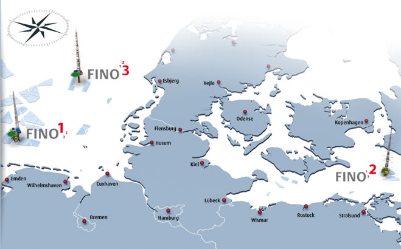

## Long term extension using MCP and remodeling(c)
### In this chapter we are using two sources for the data:
1. fino offshore public datasets for the measurements of wind data. The met tower selected is FINO 2. The data can be found in the [FINO1,2,3](https://www.fino-offshore.de/de/index.html) website. The met mast is located in the offshore wind farm in Denmark.
  The location of the met mast is 55.007 latitude and 13.154 longitude in the EPSG:4326 projection(WGS84 lat lon).

2. We are also using different datasets from mesoscale models computed at [Vortex f.d.c](https://vortexfdc.com) 
    2. 1. SERIES: 20 year long time series computed using WRF at 3km final spatial rsolution. Heights from 30m to 300m height. 
    2. 2. LES: 1 year long time series using WRF and nested WRF-LES computed at 100m final spatial resolution from 30m to 300m height. 

### Notebooks:
1. [Reading datasets](reading-datasets.ipynb) we are reading the datasets using python. We read both txt and netcdf files and store in xarray/pandas objects.
